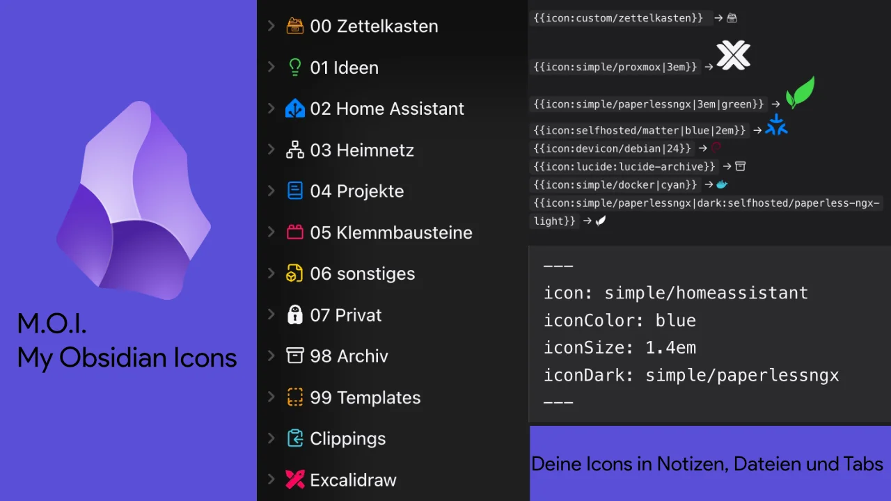

# M.O.I. – My Obsidian Icons



English: [README.md](README.md)

## Warum es das gibt

Ich wollte meine eigenen SVG-Dateien in Obsidian benutzen. So einfach klingt das, ich habe aber
kein Plugin gefunden, das es so macht, wie ich es wollte. Die, die ich ausprobiert habe,
wussten viel über die Oberfläche, aber ihre Icons kamen von irgendwo anders, und ich musste
Dateien von Hand exportieren, um die Icons zu bekommen, die ich selbst gezeichnet hatte.

Also habe ich angefangen, mein eigenes zu schreiben. Die erste Version konnte drei Dinge: einen
Ordner voller eigener SVGs lesen, einen Shortcode in ein Icon verwandeln, und jeder Datei und
jedem Ordner per Rechtsklick ein Icon mit Farbe geben. Alles danach kam aus dem Gebrauch.

Was es unterscheidet: Das Icon in einer Notiz ist einfach ein Shortcode.

```
{{icon:my-own-icon}}
```

Denkst du das in eine Notiz, sucht das Plugin nach `_assets/icons/my-own-icon.svg`. Zeichne das
SVG selbst, leg es in den Ordner, und es erscheint. Kein Import, kein Format zum Lernen, keine
Liste freigegebener Icons. Ist die Datei nicht da, bleibt der Text Text und die Konsole sagt dir,
welchen Namen es gesucht hat.

Dazu lädt es Devicon, Simple Icons und die selfh.st-Homelab-Sammlung bei Bedarf nach und kann
die Icons benutzen, die Obsidian schon mitbringt.

## Wie es entstanden ist

Ich habe es mit [opencode](https://opencode.ai) geschrieben, meistens mit Claude-Modellen,
manchmal mit anderen. Es fing als grobe Version an einem Tag an und hat danach viele
Review-Runden durchlaufen. Der größte Teil der Arbeit waren keine neuen Funktionen, sondern das
Finden von Fehlern.

Drei Review-Runden bisher, und jede hat echte Fehler gefunden, nicht Kosmetik. Eine Datei
konnte von zwei Zuordnungen gleichzeitig überschrieben werden, wenn zwei Tabs parallel
auslösten. Icons in Codeblöcken wurden zu Bildern, man konnte die Syntax des Shortcodes also
nicht aufschreiben. Nicht geprüfte Einstellungen aus `data.json` wurden ungefragt übernommen,
ein falscher Typ in einem Pfadfeld brach die Icon-Suche ab. Das Bundle war 289 KB groß, weil
niemand die Minifizierung eingeschaltet hatte, jetzt sind es 198 KB.

Die Testsuite ist mitgewachsen, von nichts auf 77 Tests. `npm test` muss durch, bevor ein Commit
landet, und sowohl der Plugin-Baum als auch die Testskripte werden typgeprüft.

Das ist der ehrliche Stand: Der Code ist meiner und ich verstehe ihn, aber ich habe nicht jede
Zeile von Hand geschrieben, und die Review-Runden haben mehr zur Qualität beigetragen als die
Entwürfe.

## Was es kann

- `{{icon:name}}` irgendwo in einer Notiz, mit optionaler Größe, Farbe und dunkler Variante
- Icons in der Seitenleiste, per Rechtsklick gesetzt, mit Farbe und Größe je Datei oder Ordner
- Dasselbe Icon in der Tableiste und im Notiztitel
- Frontmatter-Felder `icon`, `iconColor`, `iconSize` und `iconDark` für eine einzelne Notiz
- Ein Icon je Dateiendung als Rückfall
- Icon-Auswahl mit Suche, Vorschau, Favoriten und freiem Hex-Wert
- Vorschläge für den Shortcode und für die Frontmatter-Felder
- Galerie mit allen vergebenen Icons und ungenutzten Dateien
- Devicon, Simple Icons und selfh.st bei Bedarf nachladen, Geräte-Cache
- Gesamten Bestand als JSON-Paket exportieren und wieder einlesen
- Oberfläche auf Deutsch, Englisch, Französisch und Spanisch

Ohne Laufzeitabhängigkeiten.

## Install

`manifest.json`, `main.js` und `styles.css` nach
`<Vault>/.obsidian/plugins/moi-icons/` kopieren und das Plugin unter Einstellungen,
Community-Plugins aktivieren. Diese drei Dateien sind das ganze Plugin.

Selbst bauen: Repository holen und dann

```
npm install --legacy-peer-deps
npm run build
```

`--legacy-peer-deps` ist nötig, weil `obsidian` eine ältere `@codemirror/state` verlangt als die
installierte. Nach einer Codeänderung ändert sich nur `main.js`, das muss wieder kopiert werden.
Bei einer Versionsänderung ändert sich auch `manifest.json`. `data.json` wird nie kopiert, das
enthält deine Einstellungen.

## Shortcode in Notizen

```
{{icon:name}}
{{icon:devicon/proxmox}}
{{icon:simple/homeassistant}}
{{icon:lucide:lucide-server}}
{{icon:name|24}}
{{icon:name|1.5em}}
{{icon:name|red}}
{{icon:name|24|blue}}
{{icon:name|dark:simple/docker}}
```

Der Standardordner ist `_assets/icons` und lässt sich in den Einstellungen ändern. Ohne
Größenangabe gilt 1em, eine Zahl ohne Einheit gilt als Pixel. Zweiter bis vierter Teil in
beliebiger Reihenfolge: Größe, Farbe als Theme Name oder CSS Farbe, oder dunkle Variante mit
`dark:`.

`lucide:` nutzt die Icons, die Obsidian schon mitbringt, ganz ohne Datei. Achte auf das doppelte
Präfix, `lucide:lucide-server`. Obsidian nennt seine Icons `lucide-server`, das `lucide:` davor
gehört zu diesem Plugin. Welche Icons es gibt, hängt von deiner Obsidian-Version ab, im Picker
oder in den Vorschlägen nachsehen.

Beim Tippen von `{{icon:` schlägt das Plugin Namen mit Vorschau vor, Devicon Suche versteht
zusätzlich Tags wie database.

Fehlt eine Datei, bleibt der Text stehen, `[name]` erscheint mit Tooltip, und die Konsole sagt,
welchen Namen es gesucht hat. Ein Shortcode in einem Codeblock wird nicht angefasst, im Editor
wie im Lesemodus, du kannst die Syntax also aufschreiben und jemandem zeigen.

Emoji gehen im Explorer Mapping als `emoji:📁`, als Shortcode nicht, weil der Icon Name nur
Buchstaben, Ziffern, `-`, `_`, `/`, `:` und `.` enthalten darf.

## Explorer Icons per Rechtsklick

Rechtsklick auf eine Datei oder einen Ordner, dann Icon ändern. Im Picker kannst du je Eintrag
Farbe und optional eine Größe setzen, zum Beispiel Homelab auf 1.4em. Dasselbe geht per
Rechtsklick in einer geöffneten Notiz. Der Befehl Icon für aktive Datei wählen öffnet denselben
Dialog und lässt sich unter Einstellungen, Tastenkürzel binden. Wenn du den Shortcode im Text
willst, nimm Rechtsklick, Icon einfügen, oder den Befehl Icon in Notiz einfügen, auch der
lässt sich binden.

Der Dialog zeigt Suche mit Vorschau über eigene SVGs, Devicon, Simple und Lucide. Darunter eine
Farbleiste mit neun Theme-Farben wie bei Iconic, dazu keine und ein freier Hex-Wähler. Icon
entfernen löscht die Zuordnung. Eine Mehrfachauswahl bekommt auf einmal dasselbe Icon.

Gespeichert wird in `_assets/icon-mapping.json` im Vault, zum Beispiel so:

```json
{
  "Homelab/proxmox.md": { "icon": "devicon/proxmox" },
  "Homelab": { "icon": "simple/homeassistant", "color": "blue", "iconDark": "simple/homeassistant" }
}
```

Die Kurzform `"Pfad": "devicon/docker"` ohne Farbe bleibt gültig. Umbenennen und Löschen hält
die Datei aktuell, bei Ordnern auch die Kinder. `iconDark` nennt eine Variante fürs dunkle Theme,
im Shortcode ist das `{{icon:name|dark:simple/docker}}`.

## Dateityp Icons

In den Einstellungen je Endung ein Icon als Rückfall nach Pfad und Frontmatter, zum Beispiel md
auf lucide:lucide-file-text. Start leer, Endung ohne Punkt. Gilt für Explorer, Tabs und Titel,
Ordner fallen nie darunter. Gespeichert unter `__ext__` in derselben Mapping Datei, Export und
Galerie kennen den Bereich.

## Tabs, Titel und Frontmatter

Die Tableiste und der Notiztitel zeigen dasselbe Icon aus Zuordnung oder Frontmatter, je Bereich
abschaltbar. Im Frontmatter gelten `icon`, `iconColor`, `iconSize` und `iconDark`, und das
Frontmatter gewinnt gegen die Zuordnung. Beim Bearbeiten der Quelle schlägt das Plugin Werte für
`icon`, `iconColor` und `iconDark` vor.

## Farben

Devicon-Dateien mit genau einer Farbe werden umgefärbt, wenn du eine Farbe wählst. Mehrfarbige
und Verläufe behalten ihre Farben. Das gilt auch für eigene SVGs und Simple Icons mit genau einer
festen Farbe, etwa schwarzen Pfaden. Alles ohne feste Farbe folgt der gewählten Farbe über
currentColor.

Ist dein Icon im dunklen Theme unsichtbar, steckt ein festes Schwarz im SVG und es erbt die
Textfarbe nicht. Wähle im Plugin eine Farbe, dann überschreibt sie die feste.

## Nachladen vom CDN

In den Einstellungen kannst du das Nachladen vom CDN einschalten. Fehlt ein Devicon- oder
Simple-Icon als Datei, holt das Plugin es von jsdelivr und legt es auf dem Gerät ab, begrenzt
auf 150 Einträge und 1,5 MB. Fehlversuche werden nach 5 Minuten erneut versucht. Die Namenslisten
kommen live aus devicon.json, slugs.md und der selfh.st index.json, mit eingebautem Rückfall
sowie Versionsanzeige und Neu-laden-Knopf. Im Picker erscheinen alle Namen mit Wolkensymbol, und
Auswählen lädt bei Bedarf. Offline läuft der Cache weiter. Über Als Datei speichern landet ein
CDN-Icon als SVG in _assets/icons, zum Bearbeiten oder für Git.

Ein eigener Schalter deckt die self-hosted Icons von selfh.st als `selfhosted:name` ab, rund
2400 Homelab-Marken mit Tags. Im dunklen Theme wird die helle Variante automatisch genutzt, wenn
sie vorhanden ist, und die helle Variante ist voreingestellt; eine selbst gewählte dunkle Variante
gewinnt immer.

## Export und Import

Die Befehle Icons exportieren und Icons importieren, sowie die Knöpfe in den Einstellungen,
packen die Zuordnung plus genutzte SVGs in eine `icons-export-YYYY-MM-DD.json` im Vault oder
lesen sie zurück. Ein zweiter Export am selben Tag schreibt eine zweite Datei, statt zu
überschreiben. Beim Import bleiben vorhandene Dateien erhalten; Dateien über 500 KB sowie mehr
als 10 MB oder 500 Dateien pro Paket werden übersprungen, ebenso mehr als 5000 Zuordnungen.

## Sync und Geräte

Der CDN-Cache liegt in `data.json` und wird von Obsidian Sync mitgenommen, obwohl er pro Gerät
gedacht ist. Bei geteilten Vaults auf Größe und Traffic achten, bei Bedarf im Settings den
Icon-Cache leeren.

Die Mapping-Datei ist zum Syncen gedacht, aber ohne Zusammenführen: Setzen zwei Geräte
gleichzeitig verschiedene Icons, gewinnt der letzte Schreiber. Konfliktkopien liest das Plugin
nicht. Wird die Mapping-Datei während des Betriebs gelöscht, überlebt der Zustand im Speicher und
beim nächsten Setzen wieder geschrieben.

## Picker Extras

Der Picker zeigt oben Favoriten und zuletzt benutzt, jeweils nur wenn vorhanden. Der Stern in
jeder Zeile pinnt ein Icon an oder hebt es auf. Über Dunkles Icon wählen setzt du eine Variante
fürs dunkle Theme und klickst danach ein Icon in der Liste. Ist die gewählte Farbe auf dem
Theme-Hintergrund schwer lesbar, warnt der Picker. Beide Listen liegen pro Gerät in den
Plugin-Daten.

## Galerie und Konflikte

Der Befehl Icon-Galerie öffnen listet alle vergebenen Icons mit Pfad und Entfern-Knopf, dazu
ungenutzte Dateien im Icon-Ordner. Der Befehl Icons prüfen meldet Zuordnungen ohne Ziel und
zählt ungenutzte Dateien, ohne Netz. Der Befehl Icons neu laden liest Ordner und Caches neu. Läuft
Iconic, Iconize oder Icon Folder zur selben Zeit, zeigt das Plugin einmal pro Sitzung einen
Hinweis, weil alle um dieselben DOM-Stellen konkurrieren.

## Sicherheit

SVGs aus dem eigenen Ordner und aus dem Netz werden bereinigt, bevor sie auf die Seite kommen.
Skripte, Event-Handler, externe Verweise und eingebettete Stile werden entfernt, und was übrig
bleibt, wird als SVG gerendert und nicht als HTML. Ist eine Datei nach der Bereinigung nicht
brauchbar, zeigt das Plugin `[name]` statt einer leeren Stelle.

CDN-Icons kommen nur von jsdelivr, und nur wenn du den Schalter einschaltest. Sonst verlässt
nichts deinen Rechner.

## Mobil

Alle Befehle laufen auch am Handy. Um unterwegs einzufügen, lege einen Befehl wie Icon in Notiz
einfügen auf die mobile Leiste unter Einstellungen, Toolbar; Plugins können dort keine Knöpfe
anlegen. Rechtsklick heißt lang drücken.

## Sprache

Die Oberfläche richtet sich nach der Spracheinstellung von Obsidian und liegt auf Deutsch,
Englisch, Französisch und Spanisch vor. Das betrifft Befehle, Kontextmenüs, den Einstellungs-Tab,
den Picker, die Galerie und alle Meldungen. Der Slogan folgt derselben Sprache: *Local,
lightweight, yours.* (de *Lokal, leicht, deins.*, fr *Local, léger, à vous.*, es *Local, ligero,
tuyo.*). Steht Obsidian auf einer anderen Sprache, greift Englisch.

Die Warnungen in der Entwicklerkonsole bleiben deutsch, das sind Meldungen für die Fehlersuche
und keine Texte der Oberfläche. Diese Fassung ist die deutsche, die englische liegt in
`README.md`.

## Starter Icons

In `starter-icons/` liegen 30 Devicon Homelab Icons, 10 Simple Icons Marken sowie Dockhand,
Technitium und AdGuard Home als Grundstock. Inhalt nach `_assets/icons/` in den Vault kopieren,
dann gilt zum Beispiel {{icon:dockhand}}. Erzeugt mit `python3 scripts/fetch-icons.py`.

## Lizenz

MIT, siehe [LICENSE](LICENSE).

Mitgelieferte Fremdinhalte stehen in
[LICENSES-THIRD-PARTY.md](LICENSES-THIRD-PARTY.md): Devicon steht unter MIT, Simple Icons unter
CC0, selfh.st Icons unter CC-BY-4.0 mit Namensnennung an selfh.st. Lucide wird nicht
mitgeliefert, die Icons kommen von Obsidian selbst. Marken und Logos gehören den jeweiligen
Eigentümern und dienen nur der Kennzeichnung in der eigenen Doku.