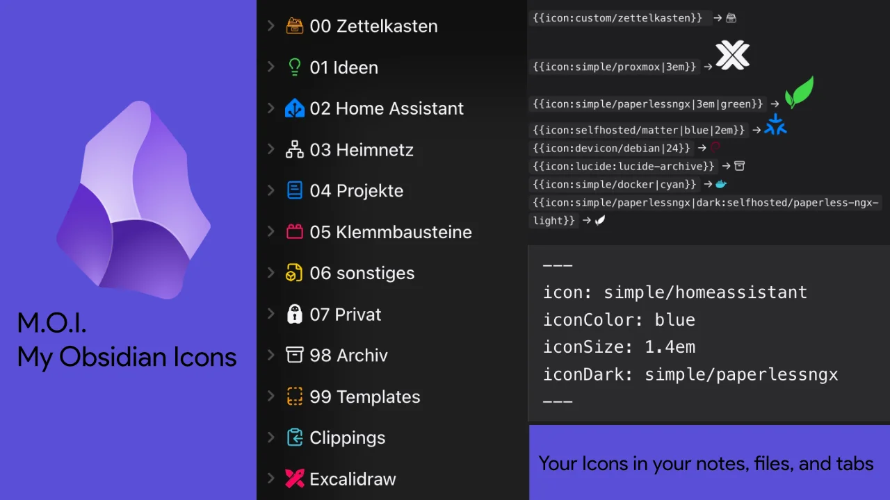

# M.O.I. – My Obsidian Icons



Deutsch: [README.de.md](README.de.md)

## Why this exists

I wanted to use my own SVG files in Obsidian. Simple as that sounds, I could not find a plugin
that did it the way I wanted. The ones I tried knew a lot about the interface, but they pulled
their icons from somewhere else, and I was left exporting files by hand to get the icons I had
drawn myself into a note.

So I started writing my own. The first version did three things: it read a folder of my SVGs,
it turned a shortcode into an icon, and it let me set an icon and a color on any file or folder
with a right click. Everything after that came out of using it.

What makes it different: the icon in a note is just a shortcode.

```
{{icon:my-own-icon}}
```

Put that anywhere in a note and the plugin looks for `_assets/icons/my-own-icon.svg`. Draw the
SVG yourself, drop it in that folder, and it shows up. No import step, no format to learn, no
list of pre-approved icons. If the file is not there, the text stays text and the console tells
you which name it looked for.

On top of that it loads Devicon, Simple Icons and the selfh.st homelab set on demand, and it
can use the icons Obsidian already ships.

## How it was built

I wrote it with [opencode](https://opencode.ai), mostly with Claude models, sometimes others. It
started as a rough version in a day and then went through a lot of review rounds. Most of the
work was not adding features, it was finding the mistakes.

Three rounds of review so far, and each found real bugs rather than cosmetics. A file could be
overwritten by two mappings at once when two tabs fired simultaneously. Icons inside code
blocks turned into pictures, so an example of the shortcode syntax could not be written down.
Untrusted settings from `data.json` were taken at face value, so a wrong type in a path field
crashed the icon lookup. The bundle was 289 KB because nobody had turned on minification; it is
198 KB now.

The test suite grew with it, from nothing to 77 tests. `npm test` has to pass before a commit
lands, and both the plugin tree and the test scripts are type checked.

That is the honest state of it: the code is mine and I understand it, but I did not write every
line by hand, and the review rounds did more for the quality than the first drafts did.

## What it does

- `{{icon:name}}` anywhere in a note, with optional size, color and a dark theme variant
- Icons in the file explorer, set with a right click, with color and size per file or folder
- The same icon in the tab bar and in the note title
- Frontmatter fields `icon`, `iconColor`, `iconSize` and `iconDark` for a single note
- One icon per file extension as a fallback
- Icon picker with search, preview, favorites, and a free hex color
- Autocomplete for the shortcode and for the frontmatter fields
- Icon gallery listing everything assigned, plus unused files
- Load Devicon, Simple Icons and selfh.st on demand, cached on the device
- Export and import the whole setup as a JSON package
- Interface in German, English, French and Spanish

No runtime dependencies.

## Install

Copy `manifest.json`, `main.js` and `styles.css` into
`<Vault>/.obsidian/plugins/moi-icons/` and enable the plugin under Settings, Community
plugins. Those three files are the whole plugin.

To build it yourself, clone the repository and run:

```
npm install --legacy-peer-deps
npm run build
```

The `--legacy-peer-deps` is required, because `obsidian` asks for an older `@codemirror/state`
than the installed one. After a code change only `main.js` changes and has to be copied again.
When the version changes, `manifest.json` changes too. `data.json` is never copied, it holds
your settings.

## Shortcode in notes

```
{{icon:name}}
{{icon:devicon/proxmox}}
{{icon:simple/homeassistant}}
{{icon:lucide:lucide-server}}
{{icon:name|24}}
{{icon:name|1.5em}}
{{icon:name|red}}
{{icon:name|24|blue}}
{{icon:name|dark:simple/docker}}
```

The default folder is `_assets/icons` and can be changed in the settings. Without a size, 1em
applies; a plain number counts as pixels. Second to fourth part in any order: size, color as a
theme name or CSS color, or a dark variant with `dark:`.

`lucide:` uses the icons Obsidian already ships, no file needed. Note the doubled prefix,
`lucide:lucide-server`. Obsidian names its icons `lucide-server`, and the `lucide:` in front of
it belongs to this plugin. Which icons exist depends on your Obsidian version, so look them up
in the picker or in the suggestions.

While typing `{{icon:` the plugin suggests names with a preview, and Devicon search also
understands tags like database.

If a file is missing, the text stays as it is, `[name]` appears with a tooltip, and the console
tells you which name it looked for. A shortcode inside a code block is never touched, in the
editor as well as in reading view, so you can write the syntax down and show it to someone.

Emoji work in the explorer mapping as `emoji:📁`, but not as a shortcode, because the icon name
may only contain letters, digits, `-`, `_`, `/`, `:` and `.`.

## Explorer icons via right-click

Right-click a file or folder, then Change icon. In the picker you can set a color and an
optional size per entry, for example Homelab to 1.4em. The same works via right-click inside an
open note. The command Choose icon for active file opens the same dialog and can be bound to a
shortcut under Settings, Hotkeys. If you want the shortcode in the text, use right-click,
Insert icon, or the command Insert icon into note, also assignable to a shortcut.

The dialog shows search with a preview over your own SVGs, Devicon, Simple and Lucide. Below
that a color row with nine theme colors like in Iconic, plus none and a free hex picker. Remove
icon deletes the assignment. A multi-selection gets the same icon at once.

It is stored in `_assets/icon-mapping.json` in the vault, for example:

```json
{
  "Homelab/proxmox.md": { "icon": "devicon/proxmox" },
  "Homelab": { "icon": "simple/homeassistant", "color": "blue", "iconDark": "simple/homeassistant" }
}
```

The short form `"path": "devicon/docker"` without a color stays valid. Renaming and deleting
keeps the file up to date, including children for folders. `iconDark` names a variant for the
dark theme; in the shortcode that is `{{icon:name|dark:simple/docker}}`.

## File type icons

In the settings, one icon per extension as a fallback after path and frontmatter, for example
md to lucide:lucide-file-text. Starts empty, extension without a dot. Applies to explorer, tabs
and titles; folders never fall under it. Stored under `__ext__` in the same mapping file; export
and gallery know that section.

## Tabs, titles and frontmatter

The tab bar and the note title show the same icon from mapping or frontmatter, switchable per
area. In frontmatter, `icon`, `iconColor`, `iconSize` and `iconDark` apply, and frontmatter wins
over mapping. When editing the source, the plugin suggests values for `icon`, `iconColor` and
`iconDark`.

## Colors

Devicon files with exactly one color are recolored when a color is chosen; multi-colored ones and
gradients keep their original colors. The same applies to your own SVGs and Simple Icons with
exactly one fixed color, for example black paths. Anything without a fixed color follows the
chosen color via currentColor.

If your icon is invisible in the dark theme, it has a fixed black color built into the SVG and
does not inherit the text color. Pick a color in the plugin and it overwrites the fixed one.

## Loading from CDN

In the settings you can enable loading from CDN. If a devicon or simple icon is missing as a
file, the plugin fetches it from jsdelivr and caches it on the device, limited to 150 entries
and 1.5 MB. Failures are retried after 5 minutes. The name lists come live from devicon.json,
slugs.md and the selfh.st index.json, with a built-in fallback plus a version display and a
reload button. In the picker all names appear with a cloud symbol, and selecting one loads it on
demand. Offline, the cache keeps working. Via Save as file, a CDN icon lands as an SVG in
_assets/icons, for example for editing or for Git.

A separate switch covers self-hosted icons from selfh.st as `selfhosted:name`, around 2,400
homelab brands with tags. In the dark theme the light variant is used automatically when
available, and the light variant is on by default; a manually chosen dark variant always wins.

## Export and import

The commands Export icons and Import icons, as well as the buttons in the settings, pack the
mapping plus used SVGs into an `icons-export-YYYY-MM-DD.json` in the vault, or read it back.
Exporting twice on the same day writes a second file rather than overwriting. Existing files
are kept during import; files over 500 KB, as well as more than 10 MB or 500 files per package,
are skipped, as are more than 5000 mapping entries.

## Sync and devices

The CDN cache lives in `data.json` and is synced by Obsidian Sync, even though it is meant per
device. For shared vaults, keep an eye on size and traffic; if needed, clear the icon cache in
the settings.

The mapping file is made for sync, but without merging: if two devices set different icons at
the same time, the last writer wins. The plugin does not read conflict copies. If the mapping
file is deleted while the plugin is running, the in-memory state survives and is written again
on the next set.

## Picker extras

The picker shows favorites and recently used at the top, each only when present. The star in
each row pins or unpins an icon. Via Choose dark icon you can set a variant for the dark theme,
then click an icon in the list. If the chosen color is hard to read on the theme background, the
picker warns. Both lists live per device in the plugin data.

## Gallery and conflicts

The command Open icon gallery lists all assigned icons with path and a remove button, plus
unused files in the icon folder. The command Check icons reports mapping entries without a
target and counts unused files, without network. The command Reload icons re-reads folders and
caches. If Iconic, Iconize or Icon Folder is active at the same time, the plugin shows a notice
once per session, since all of them compete for the same DOM spots.

## Security

SVGs from your own folder and from the network are cleaned before they reach the page. Scripts,
event handlers, external references and embedded styles are removed, and what is left is
rendered as an SVG rather than as HTML. If a file is not usable after cleaning, the plugin shows
`[name]` instead of an empty space.

CDN icons are fetched from jsdelivr only, and only when you turn the setting on. Nothing else
leaves your machine.

## Mobile

All commands run on the phone. To insert on the go, put a command such as Insert icon into note
on the mobile toolbar under Settings, Toolbar; plugins cannot add buttons there directly.
Right-click means long-press.

## Language

The interface follows Obsidian's language setting and is available in German, English, French
and Spanish. This covers commands, context menus, the settings tab, the picker, the gallery and
all messages. The slogan uses the same language: *Local, lightweight, yours.* (de *Lokal, leicht,
deins.*, fr *Local, léger, à vous.*, es *Local, ligero, tuyo.*). If Obsidian is set to another
language, English is used.

Warnings in the developer console stay German; those are messages for debugging, not interface
text. This is the English version; the German one is in `README.de.md`.

## Starter icons

`starter-icons/` holds 30 Devicon homelab icons, 10 Simple Icons brands, and Dockhand,
Technitium and AdGuard Home as a base. Copy the contents to `_assets/icons/` in the vault, then
for example {{icon:dockhand}} works. Generated with `python3 scripts/fetch-icons.py`.

## License

MIT, see [LICENSE](LICENSE).

Bundled third-party content is listed in
[LICENSES-THIRD-PARTY.md](LICENSES-THIRD-PARTY.md): Devicon is MIT, Simple Icons is CC0,
selfh.st icons are CC-BY-4.0 with attribution to selfh.st. Lucide is not bundled, its icons
come from Obsidian itself. Trademarks and logos belong to their respective owners and serve
only to identify them in your own documentation.